# Metasploitable3 Ubuntu Lab Report

## 1. Executive Summary
The objective of this lab was to explore and exploit vulnerabilities in a **Metasploitable3 Ubuntu VM**.  
Using multiple web, service, and database exploits, access was escalated from unprivileged users to **root**.  
Intrusion Detection System (IDS) monitoring highlighted which attacks were detected or undetected, providing insight into the effectiveness of deployed security controls.

---

## 2. Lab Environment

| Component       | Configuration                          |
|-----------------|----------------------------------------|
| **Host OS**     | Ubuntu / Windows / macOS              |
| **Virtualization** | ESXi                               |
| **VM OS**       | Ubuntu 14.04 (Metasploitable3)         |
| **Network**     | Bridged / NAT / Internal               |
| **Tools**       | Metasploit, Hydra, Snort3, SQL clients, Nmap |

---

## 3. Methodology

### 3.1 Initial Recon / Enumeration

| Step | Target / Service | Tool / Method | Output / Findings          |
|------|------------------|---------------|----------------------------|
| 1    | VM network / ports | Nmap        | Open ports: FTP, HTTP, SSH, SMB, etc. |

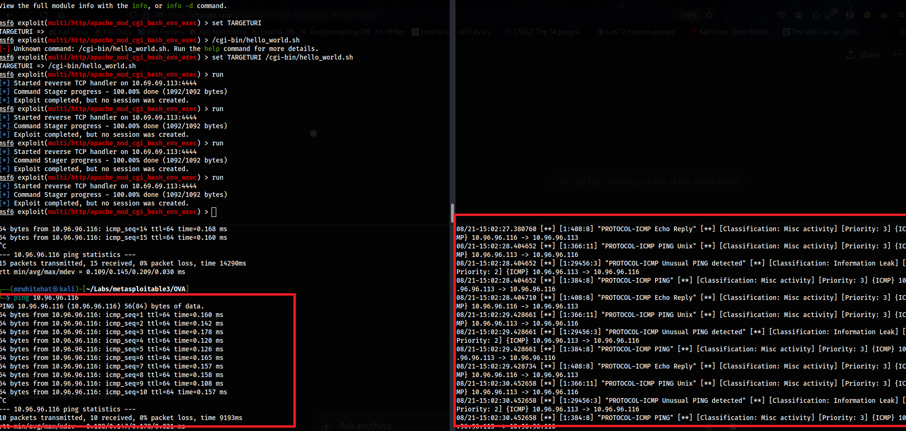
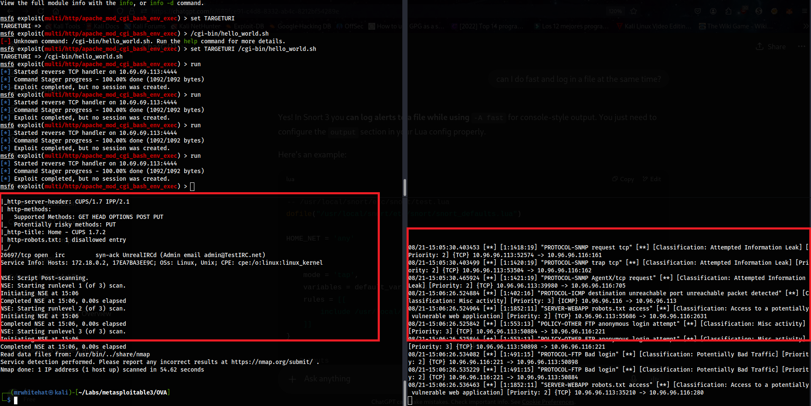

---

### 3.2 Initial Access

| Step | Target / Service | Exploit / Method | Access Gained | IDS Detection |
|------|------------------|------------------|---------------|---------------|
| 1    | phpMyAdmin       | MSF `phpmyadmin_preg_replace` | www-data shell | Undetected |
| 2    | Apache mod_cgi   | MSF `apache_mod_cgi_bash_env_exec` | www-data shell | **Detected** |
| 3    | ProFTPD          | MSF `modcopy`   | www-data shell     | Undetected |
| 4    | Web upload       | MSFvenom php payload / PHP reverse shell / PHP bash shell | www-data shell | Detected / Undetected |
| 5    | Payroll portal   | SQL Injection (Payload=' or 1=1; --)   | Retrieved PII / credentials | Undetected |
| 6    | SSH brute force  | Metasploit w/ passwd users | Dead end | Undetected |
| 7    | FTP brute force  | Hydra           | Dead end      | **Detected** |
| 8    | SMB Upload payload | MSF           | www-data shell      | **Detected** |

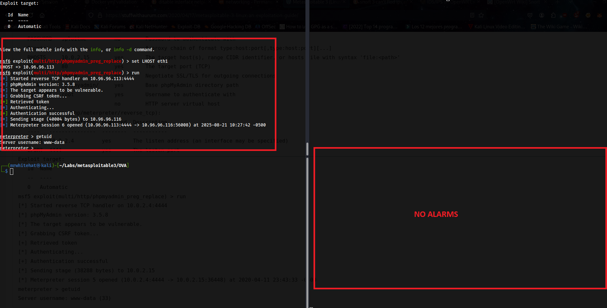
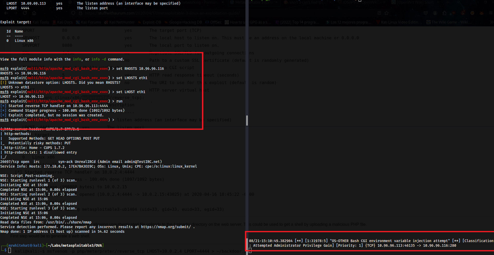
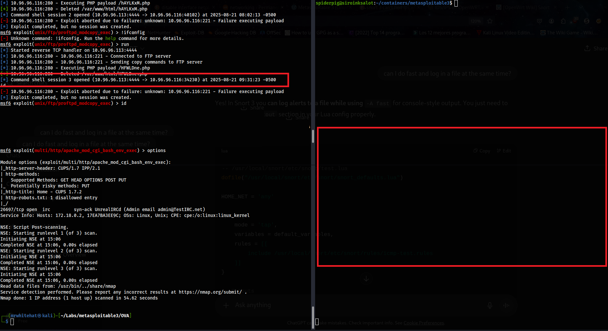
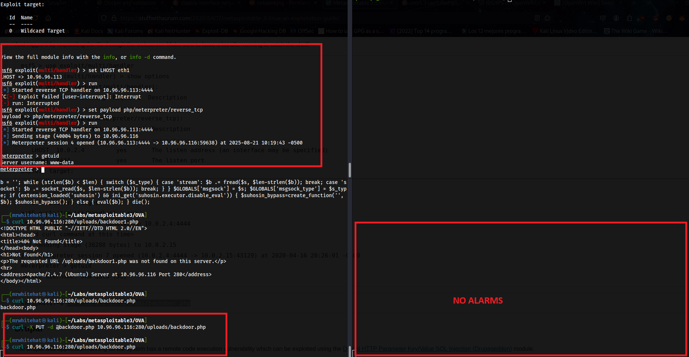
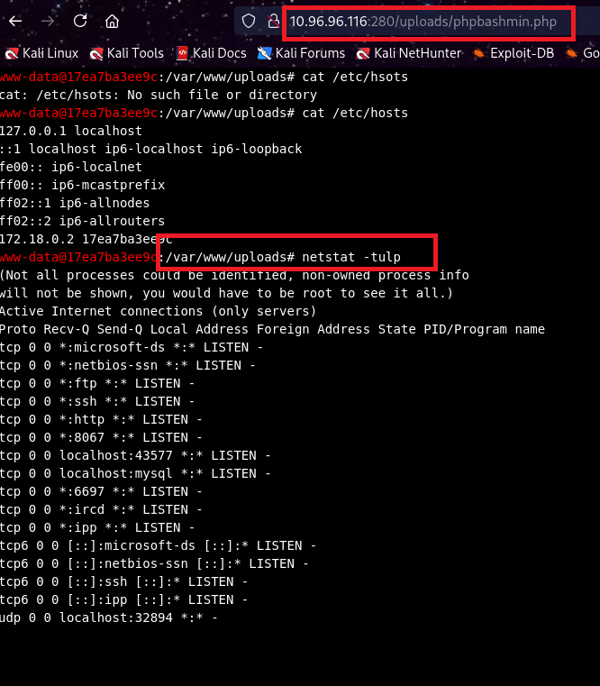
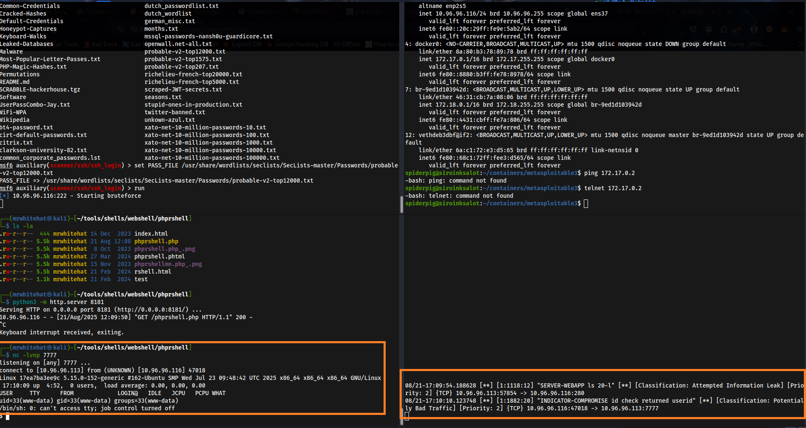
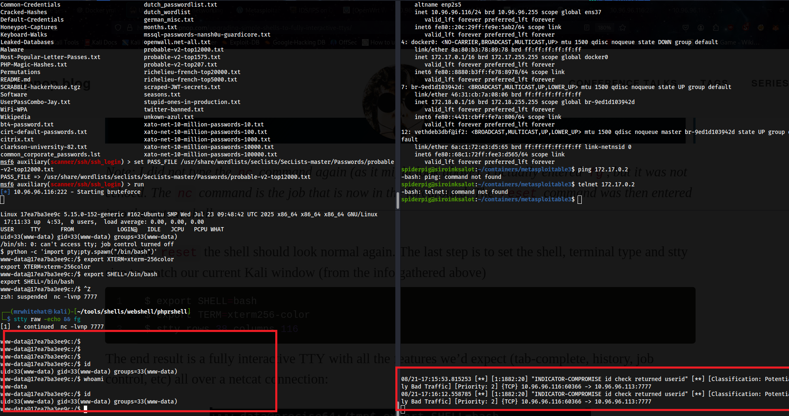
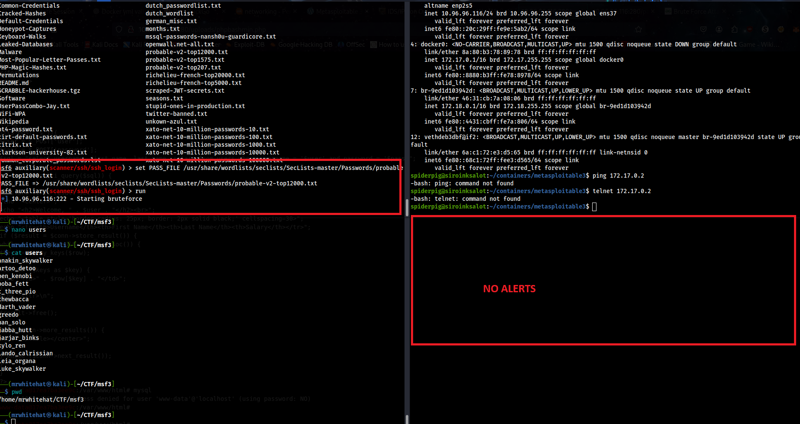
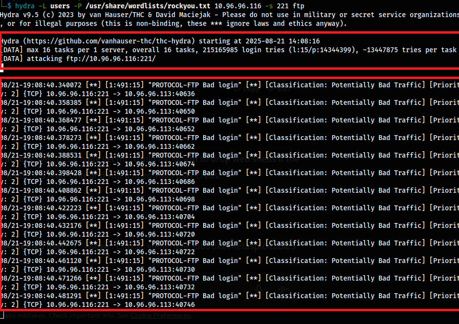
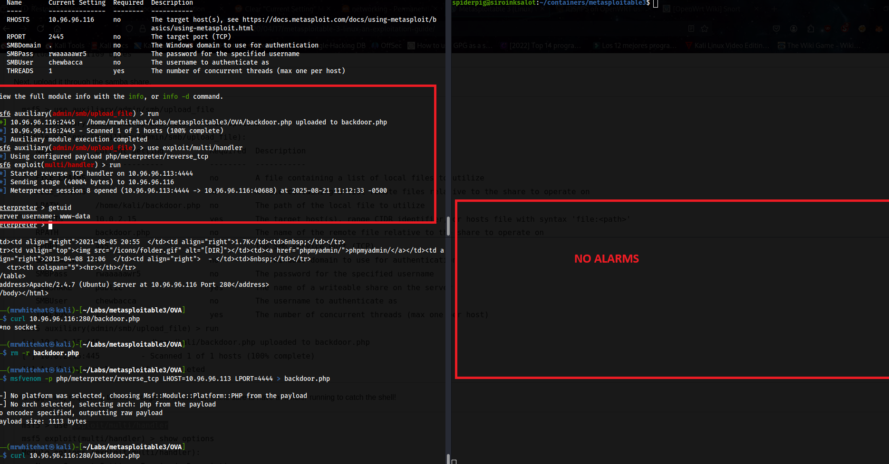

---

### 3.3 Post-Exploitation

| Step | Target       | Findings |
|------|--------------|----------|
| 1    | Databases    | Dumped payroll and drupal DB, cracked hashes, extracted PII |
| 2    | File system  | Enumeration of secrets; identified sudo users    |

---

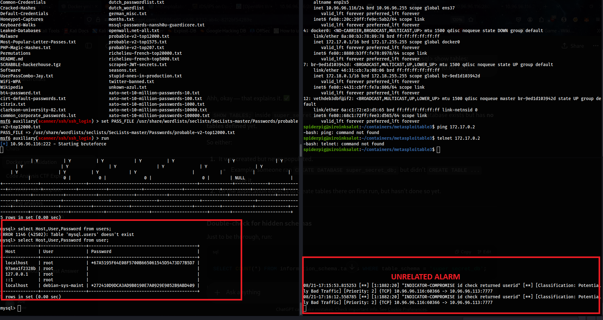
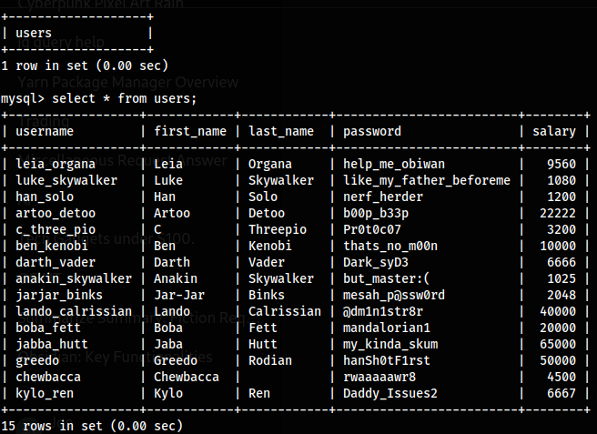
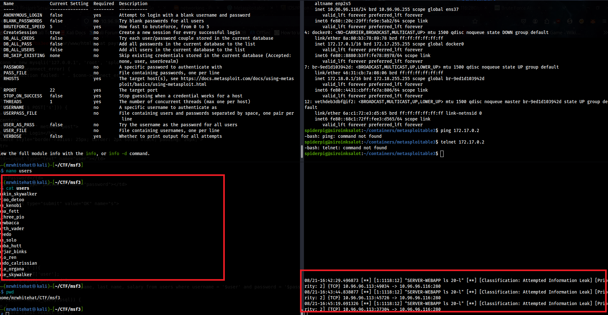
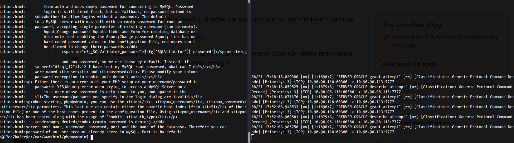
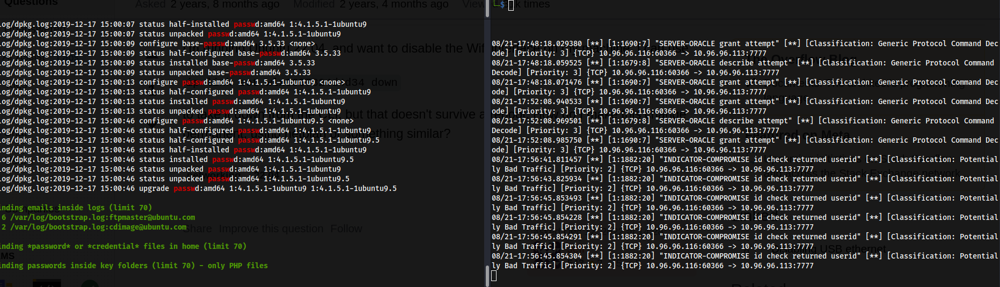

### 3.4 Privilege Escalation

** Horizontal **

| Step | Method                              | User Gained | Notes        |
|------|--------------------------------------|-------------|--------------|
| 1    | `su luke_skywalker Password: <password_from_db>`  | root        | Successful   |

** Vertical **

| Step | Method                              | User Gained | Notes        |
|------|--------------------------------------|-------------|--------------|
| 1    | `sudo -u#-1 /bin/bash -p` exploit   | root        | Successful   |

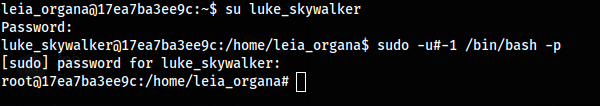

---

### 3.5 Detection / Countermeasures Observed

| Step | Exploit        | IDS Detection |
|------|----------------|---------------|
| 1    | Apache mod_cgi | **Detected**  |
| 2    | FTP Hydra      | **Detected**  |
| 3    | SQLi           | Undetected    |
| 4    | Reverse shells | Mixed         |
| 5    | Info extraction | Mixed         |

---

## 4. Findings

- Several services were vulnerable to **outdated exploits** (PHP, Apache, ProFTPD).  
- Default and **weak credentials** enabled privilege escalation.  
- IDS was **partially effective**; some exploits went undetected.  
- Sensitive data (payroll DB, hashes) was accessible due to **misconfigurations**.  

---

## 5. Lessons Learned

- Regular patching and secure configurations significantly reduce the attack surface.  
- IDS/IPS tuning is crucial to detect anomalous activity.  
- Multiple attack paths exist — combining service exploits and database attacks can yield root access.  
- Methodical enumeration and structured privilege escalation planning pay off.  

---

## 6. Appendix / Supporting Data

- **Snort rules used:**  
  `/usr/local/snort/etc/snort/rules/snort3-community-rules/`  

- **Artifacts included:**  
  - Commands and outputs for exploits and enumeration  
  - Screenshots of successful access or IDS alerts  

